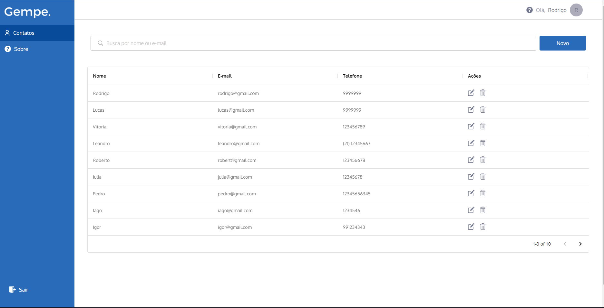
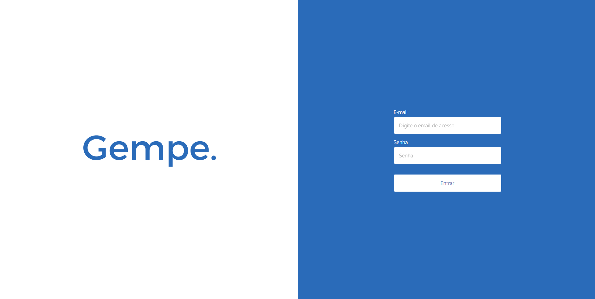
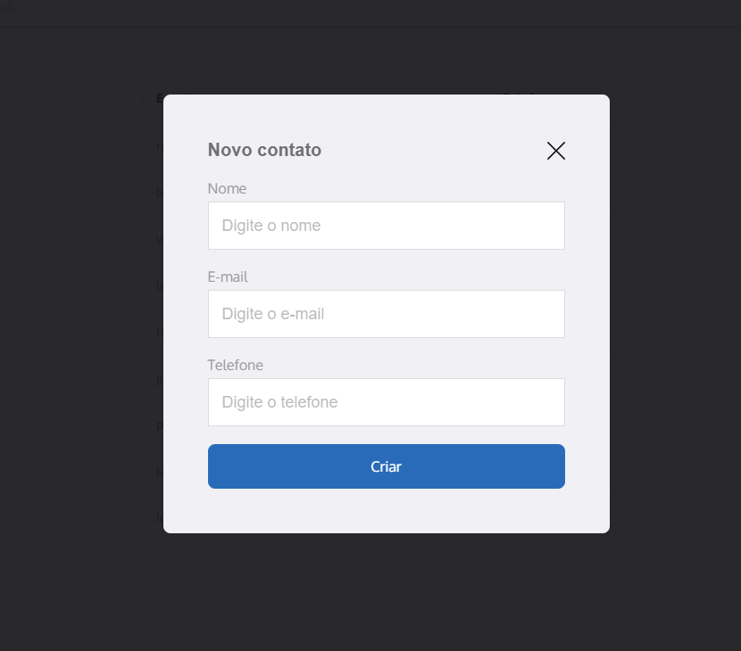
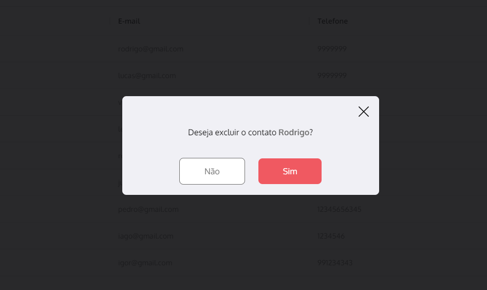

# Gempe - FrontEnd

<div style="display: flex; flex-direction: column; justify-content: center; align-items: center; margin-bottom: 100px" >
  
  
  
  
</div>


To run this you'll have to have the <a href="https://github.com/rodrigoantas/gempe-backend"> back-end.</a> Once you've cloned the repository, run ``` yarn ```. Then, run ```yarn start.``` 

